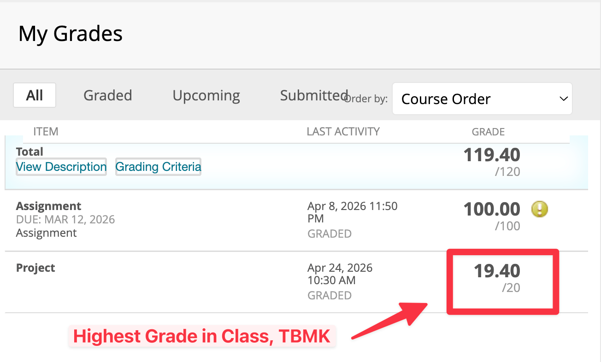

# COMP3334 Computer System Security

- **Personal Rating:** 9/10
- **Final Grade:** A+
- **Recommendation:** Mandatory
- **Difficulty:** Medium (but some people also thought it was Hard)

## 💭 Comments:
- I personally had a lot of fun with this course (I love cryptography).
- The course is quite comprehensive, covering cryptography, authentication, web security, and some advanced topics (e.g., Shamir's Secret Sharing).
- The content is largely centered on modeling, meaning how to model data flow in ways that achieve the desired security properties (confidentiality, integrity, availability). A few topics also require an algebraic foundation; for example, RSA requires you to understand Euler's totient function and the Extended Euclidean Algorithm.
- **But no worries, I've put together a note for y'all (see below)**

---

## 📚 Additional Resources:
- [**👉 My Personal Notes 👈**](https://wangyq.notion.site/comp3334-computer-system-security) - **Feel free to check it out!** 
- [**Signal Stack**](https://signal.org/docs/) — I also learned a lot of advanced algorithms from Signal's software stack (Signal is an end-to-end encrypted messenger), which inspired my project and allowed me to get high grades.

# Notice

This repository contains academic work completed during my studies at The Hong Kong Polytechnic University (PolyU). 

**⚠️ Important Disclaimers:**

1. This work is shared for reference and learning purposes only
2. Direct copying or partial submission of this work for assignments constitutes academic misconduct
3. While I have made my best effort in creating these materials, no warranty or guarantee is provided for their accuracy or completeness

**🔒 Usage Guidelines:**
- Use as a reference to understand concepts
- Learn from the implementation approaches
- Do not submit any part of this work as your own
- Adhere to PolyU's academic integrity policies

The author bears no responsibility for any academic misconduct or misuse of these materials.
