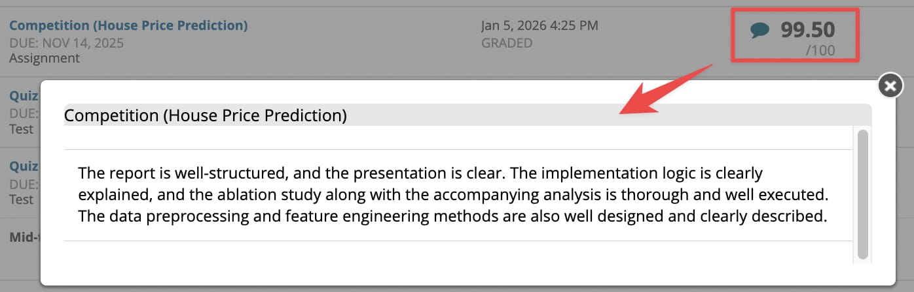

# COMP4433 Data Mining

- **Personal Rating:** /10
- **Final Grade:** A+
- **Difficulty**: Easy
- **Recommendation**: Highly recommend for those who want an easy A

# Comments:
- [Prof. Korris](https://web.comp.polyu.edu.hk/cskchung/) is amazing.
- High grades are achievable. Quite lenient grading.
- Course content is easy, which can be good or bad depending on your goals.
- Most of the learning comes from group & individual projects.
- Project grades can be very high if you're competitive.

# Additional Resources:
- [**👉 My Personal Notes 👈**](https://wangyq.notion.site/machine-learning-notes)
  - **Important:** This material extends **beyond** the COMP4432 syllabus.
  - This is my personal exploration into ML that includes additional topics (e.g., theoretical proofs) not covered in the original lectures.
- [**Cheatsheet (PDF)**](cheatsheet/dsai4204_cheatsheet.pdf)
- [Course Homepage](https://www4.comp.polyu.edu.hk/~cskchung/DSAI4204/)

---

# Notice

This repository contains academic work completed during my studies at The Hong Kong Polytechnic University (PolyU). 

**⚠️ Important Disclaimers:**
1. This work is shared for reference and learning purposes only
2. Direct copying or partial submission of this work for assignments constitutes academic misconduct
3. While I have made my best effort in creating these materials, no warranty or guarantee is provided for their accuracy or completeness

**🔒 Usage Guidelines:**
- Use as a reference to understand concepts
- Learn from the implementation approaches
- Do not submit any part of this work as your own
- Adhere to PolyU's academic integrity policies

The author bears no responsibility for any academic misconduct or misuse of these materials.
