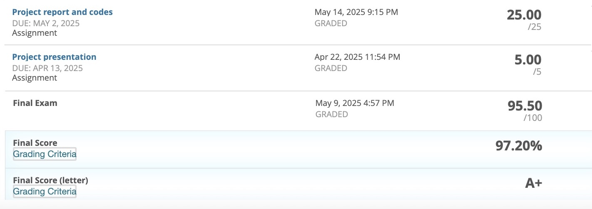

# COMP4434 Big Data

- **Personal Rating:** 8.5/10
- **Final Grade:** A+
- **Recommendation:** N/A
- **Difficulty:** Medium (Low if experienced in ML)

## 💭 Comments:
- Relatively light workload overall
- Start group project early as deep learning model training can take time
- Lenient grading (easy to argue marks back)
- Final exam questions follow a consistent pattern; practicing past papers is sufficient to perform well
- Prof. Huang Xiao is very responsive to messages

## 📚 Additional Resources:
- If GPU resources are insufficient for the group project, consider https://www.autodl.com/, the cloud platform I used.

---

# Notice

This repository contains academic work completed during my studies at The Hong Kong Polytechnic University (PolyU). 

**⚠️ Important Disclaimers:**
1. This work is shared for reference and learning purposes only
2. Direct copying or partial submission of this work for assignments constitutes academic misconduct
3. While I have made my best effort in creating these materials, no warranty or guarantee is provided for their accuracy or completeness

**🔒 Usage Guidelines:**
- Use as a reference to understand concepts
- Learn from the implementation approaches
- Do not submit any part of this work as your own
- Adhere to PolyU's academic integrity policies

The author bears no responsibility for any academic misconduct or misuse of these materials.
